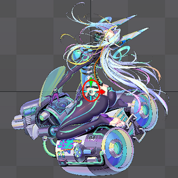

## SPINE版本 
- 3.8.x (目前3.8.95)

## 美术需求

|  类型   | 系统  | 名称  | 动画  |
|  ----  | ----  | ----  | ----  |
| UI  | shop | gems001 | dispaly,fly |
| UI  | hero | peter | idle,attack |

- 类型:
    - Spine 
    - UI (包含立绘)
- 系统：
> 系统名称 美术需求给到 如：商店-shop 英雄-hero 材料-material 道具-prop
- 名称：
> 具体需求名称 美术需求给出 如：对应具体名称 

### 对齐说明
- UI/立绘 
    - 锚点正中
- Spine 
    - 锚点 Bottom（最下面）

> 道具和角色居中

## 导出

### 骨架命名 参照美术需求

### Root点
- Root点下创建总骨用来调整位置
- Root点坐标 0-0
  

### 动画命名 参照美术需求

### 导出参数

- 扩展名
  - .skel.bytes
  

> 缩放比例0.5。
> 
> 图集过大的可以适当减小缩放比例。
> 
> 图集总大小不能超过一张2048*2048  
> 
> 图集扩展名.atlas.txt

### 参照比例模板

- 设计分辨率 1920x1080

